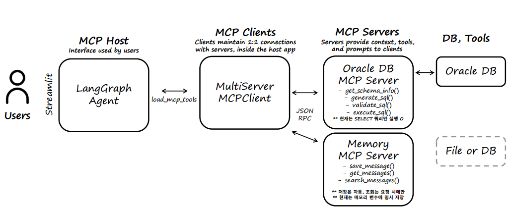
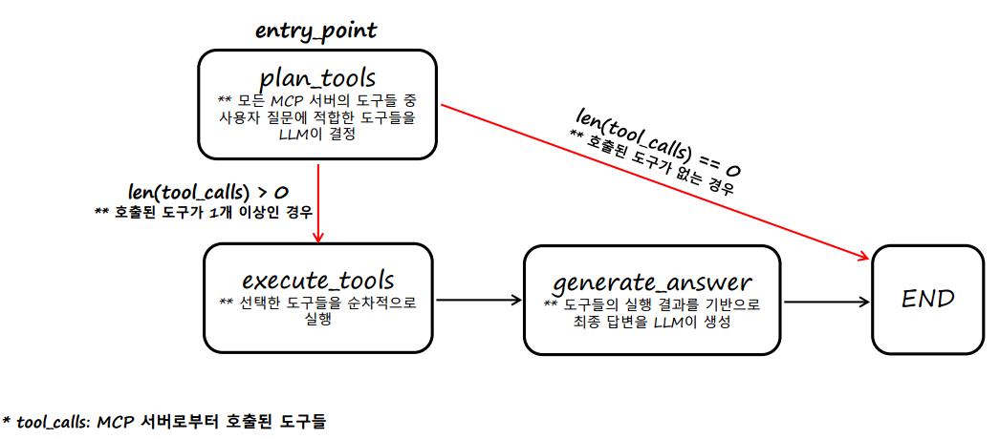

# 🤖 LangGraph Agent + MCP

[](https://www.python.org/)
[](https://gitlab.am.micube.dev/sebin07/mcp)


## ⚙️ 전체 프레임워크 구조도


- **MCP Host**: 사용자와 직접 상호 작용하는 LLM Application(예: Claude Desktop, Cursor AI, LangGraph Agent 등)으로, 여러 MCP Client들을 관리함

- **MCP Client**: Host와 Server간 연결·통신을 위한 중개자로, MCP 도구를 호출하고 결과를 받아오는 모듈(서버와 1:1 연결을 유지함)

- **MCP Server**: 도구·리소스·프롬프트를 MCP 규격으로 제공하는 외부 프로세스(예: DB·파일·웹 툴 등)


## 🧠 에이전트 구조도



## 📂 프로젝트 구조도
```bash
mcp/
├── mcp_host/
        ├── nodes/
                ├── plan_tools.py       # MCP 도구 선택/계획 노드
                ├── execute_tools.py    # MCP 도구 순차 실행 노드
                ├── generate_answer.py  # MCP 도구 실행 결과 기반 최종 답변 생성 노드
        ├── config.py        # Agent 설정 관리:  AgentConfig 
        ├── state.py         # Agent 상태 정의:  AgentState
        ├── mcp_wrapper.py   # MCP Client 래퍼: ThreadSafeMCPWrapper
        ├── graph.py         # Agent 그래프 정의: MCPAgent        
        ├── app.py           # Agent 실행 진입점: Streamlit 기반 웹 UI

├── mcp_server/
        ├── mcp_config.json      # MCP Server 설정
        ├── server_memory.py     # Memory MCP Server
        ├── server_oracle-db.py  # Oracle DB MCP Server

├── oracle/     
        ├── docker-compose.yaml  # Oracle DB 도커 컨테이너 생성
        ├── init-scripts.sql     # Oracle DB 초기화 SQL 스크립트

├── utils/            
        ├── utils.py             # 공통 유틸리티 함수 모음

├── assets/             # 프로젝트 관련 이미지/다이어그램 등 

├── .env                # 환경변수 (Ollama, Oracle DB 설정 등)
├── .gitignore          # Git 무시 파일 목록
├── .python-version     # 프로젝트에서 사용하는 Python 버전 명시                  
├── pyproject.toml      # 프로젝트 메타데이터 및 의존성
├── README.md           # 프로젝트 설명서      
├── requirements.txt    # 필요한 Python 패키지 목록(pip용)
└── uv.lock             # 의존성 잠금 파일(uv용)
```


## 🚀 실행 방법

1. 패키지 설치

    `pip install -r requirements.txt`
    
2. Streamlit UI 실행

    `streamlit run mcp_host/app.py`